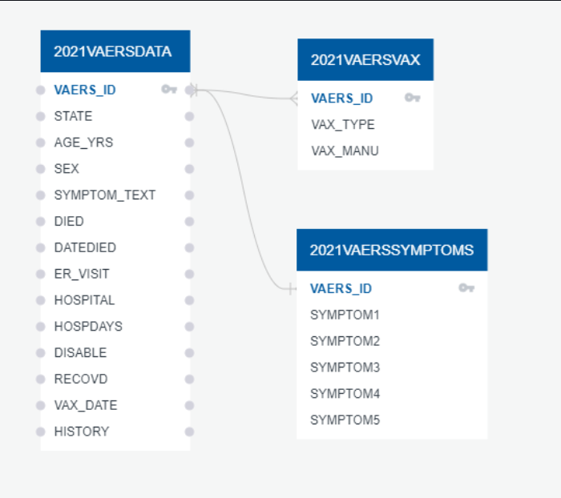

# COVID-19 VAERS ANALYSIS

  

# Overview --

## Purpose - Background & Topic Selection Reasoning

US Citizens are concerned about the risk factors of taking the COVID-19 Vaccines. We are playing the role of a team of data scientists hired by the government to analyze and assess the risk factors of receiving one of the three Emergency-Use Authorized COVID-19 vaccines. The outcome of the analysis is to help citizens make a more informed decision when taking the vaccine. We will use vaccine adverse event data provided by the government from the [Vaccine Adverse Event Reporting System.](https://vaers.hhs.gov/)

We will analyze and assess risk factors of taking the COVID19 Vaccine. We will determine the risk factors using adverse events based on age to predict life-threatening risk probability using a Machine Learning Classification Model. 

---

## Questions to Answer Based on this Data: [View Tableau - COVID-19 VAERS ANALYSIS](https://public.tableau.com/app/profile/zeke.moore6830/viz/COVID-19VAERSANALYSIS_16415030275570/COVID-19VAERSANALYSIS)

## Machine Learning:

•	Predicting life-threatening adverse events for people over 60 years old.

## Tableau:

•	What are the top negative symptoms experienced by these vaccines?

•	Comparison of three vaccines and their reported adverse events?

•	Is there a difference in the number of ER Visits or Life-Threatening events amongst the three vaccines?

•	Is there a difference in the number of those disabled or fatalities caused by the three vaccines?

## Data Description - VAERS Data

  

We will be analyzing COVID19 Vaccines Adverse events. The VAERS data is accessible by downloading raw data in comma-separated value (CSV) files for import into a database, spreadsheet, or text editing program or by using the CDC WONDER online search tool. Information provided to VAERS that identifies a person who received the vaccine or vaccines will not be available to the public. De-identified VAERS data are available 4-6 weeks after the report is received. VAERS data change as new reports are received, so your results may change if you repeat the same search at a later date. 

- The data selected has three CSV files. We obtained the data from [Vaccine Adverse Event Reporting System.](https://vaers.hhs.gov/). 

  -   Data file # 1 - 2021VAERSVAX - The CSV file contains 389,323 rows and 8 columns of vaccines information.
  -   Data file # 2 - 2021VAERSSYMPTOMS - The CSV file contains 503,422 rows and 11 columns of patient symptoms information. 
  -   Data file # 3 - 2021VAERSDATA - The CSV File comtains 376,300 rows and 35 columns of patient detail information. 
- [VAERS DATA USE GUIDE.](https://vaers.hhs.gov/docs/VAERSDataUseGuide_November2020.pdf)

----
## Resources - The technologies used for this project includes:

  

-  PostgreSQL
-  Python 
-  Pandas library
-  Machine Learning Algorithm – Scikit-Learn
-  Tableau Public  

---

## Machine Learning Model: Random Forest Classifier

We will utilize Scikit-Learn's RandomForestClassifier, an ensemble learning model, to predict life-threatening events for people over the age of 60. Originally, we looked into predicting life-threatening events for people who either died, or were hospitalized but the data was too skewed to produce any usable results. The type of data provided ultimately led to this model and process. 

### Preliminary Data Preprocessing:
- Using LabelEncoder, we will take a list of the symptoms that were found from patients with life threatening events, and convert them each into unique numbers.
- After that, we use OneHotEncoder to encode the other categorical features as an array.
- Using StandardScaler, we use it to remove the mean and scaling to unit variance.

### Preliminary Feature Engineering and Selection:

- For our feature selection, we went with a plotly bar graph to show feature importance of the top 15 columns. We decided to use this over the SelectFromModel feature because it was visually easier to read and gave us the different levels of the least important columns.

### Training and Testing:
- Applying the Train_Test_Split method, it uses arrays or matrices into random train and test subsets to input data into a single call for splitting (and optionally subsampling) data in a one-liner. At this time, there is no need for additional training of this model.

### Model:
- We used RandomForestClassifier, an estimator that fits a number of decision tree classifiers on various sub-samples of the dataset and uses averaging to improve the predictive accuracy and control over-fitting. Even though multiclass-multioutput is not supported, it was the best option because of reduced variance from combining diverse trees

### Accuracy Score:
- As of right now, the random forest predictive accuracy is 72%. With the dataset narrowed down to ids that only contained life-threatening symptoms, it is predicting the chance of these symptoms to happen to people over the age of 60.

### Conclusion:
- We were able to predict life-threatening events for people over the age of 60 by narrowing down to a DataFrame containing ID's that only had those filtered symptoms. There are further changes we can try, by doing slight adjustments to our model. We could run the prediction for each gender over 60, or even predict for each Covid-19 vaccine.

---

## Diagram DBD database structure

  

- The COVID-19 VAERS Analysis Database will be hosted locally and can run using PostgreSQL in PgAdmin (Instructions Below)

- **IMPORTANT** You will need to run your own instance in PgAdmin using the conection string provided in the SQL_DB_Connection.ipynb. Make sure to update the 'your password' section in the Config.py file with your actual password and run the code in SQL_Tables.sql.
  1. Find connection string in SQL_DB_Connection.ipynb. 
  2. Make sure to update the 'your password' section in the Config.py file with your actual password
  3. Name your SQL DataBase COVID19_VAERS_Analysis
  4. Run the code in SQL_Tables.sql.

---

## Covid-19 VAERS Analysis Project Presentation.

<h2>

[Presentation in Google Slide.](https://docs.google.com/presentation/d/1DrE1AAL-K44UNlECOkY0tXGYr80QYOi3QRh1werElQQ/edit#slide=id.p)

</h2>

